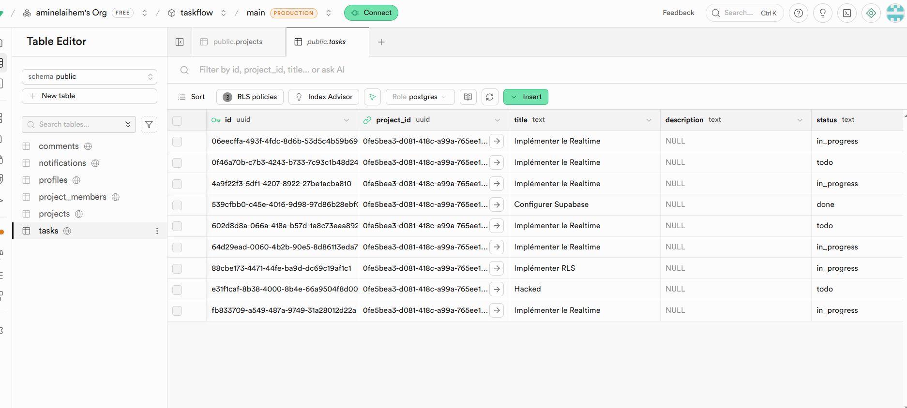
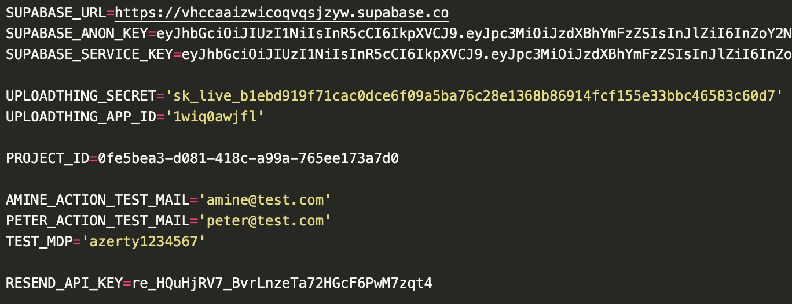
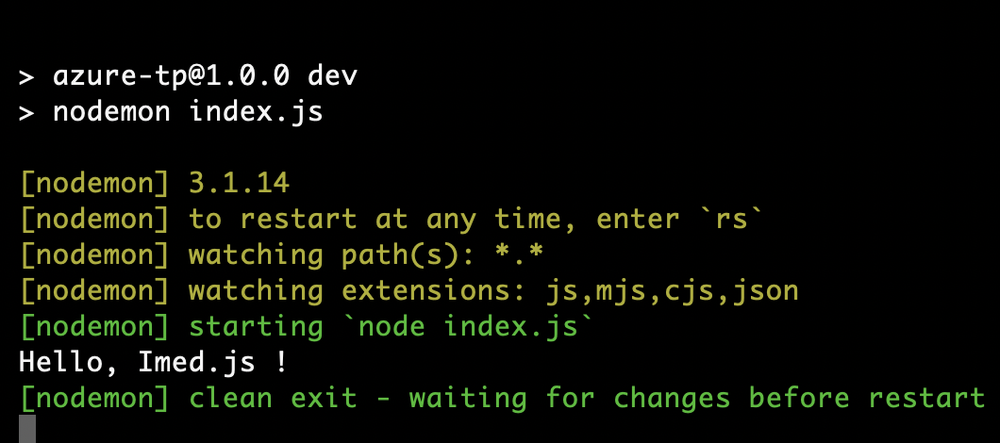
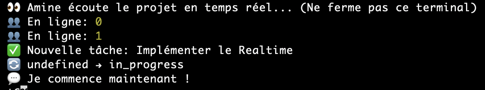
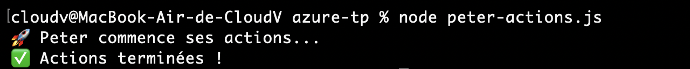

# 3 : CRUD, Uploads de fichiers & Temps réel

## Les choix techniques faits

- **Node.js** : Langage principal utilisé pour l'écriture des scripts d'interaction avec la base de données (`peter-actions.js`, `amine-watch.js`) et pour l'Azure Function.
- **Supabase** : Choisi comme Backend-as-a-Service pour sa base de données PostgreSQL, son système d'authentification robuste, et surtout ses **Webhooks de base de données** qui permettent de déclencher des appels HTTP à chaque modification des tables.
- **Azure Functions (HTTP Trigger)** : Choisi pour gérer la logique événementielle asynchrone en mode _Serverless_. La fonction `notify-assigned` écoute les changements venant de Supabase pour effectuer des actions externes sans surcharger l'application principale.
- **Resend** : Service d'envoi d'e-mails transactionnels choisi pour son API moderne, simple d'utilisation pour envoyer des alertes d'assignation de tâches.

---

## Les URLs des services déployés

- **Supabase URL** : `https://vhccaaizwicoqvqsjzyw.supabase.co`
- **Function App Webhook (Azure)** : _[À compléter par l'URL de votre fonction Azure une fois déployée sur le cloud, par exemple: https://taskflow-app.azurewebsites.net/api/notify-assigned]_

---

## Les captures d'écran des services qui tournent

**Base de données Supabase :**


**Configuration de l'environnement :**


**Exécution du serveur :**


**Surveillance en temps réel (Amine) :**


**Exécution des actions (Peter) :**


---

## Ce qui a marché, ce qui a bloqué et comment ça a été résolu

### Ce qui a marché

- La connexion à Supabase via le SDK JavaScript en tant qu'utilisateur standard (`peter@test.com`).
- L'infrastructure événementielle : le hook Supabase appelant correctement notre Webhook pour chaque `UPDATE` sur la table `tasks`.
- L'envoi des mails dynamiques avec `resend`.

### Ce qui a bloqué

1. **Erreur d'identifiant (UUID)** :
   `invalid input syntax for type uuid: "vhccaaizwicoqvqsjzyw"`
   Lors de la création initiale de la tâche, le script prenait l'ID du projet Supabase plutôt que le véritable `UUID` du projet dans la table `projects`.
2. **Erreur de permission RLS (Row Level Security)** :
   Peter n'avait pas l'autorisation d'agir (modifier le statut ou ajouter un commentaire) sur une tâche qu'il n'avait pas créée ou à laquelle il n'était pas assigné.

### Comment ça a été résolu

- Le problème de l'UUID a été résolu en récupérant le bon UUID depuis la table `projects` au lieu du préfixe de l'URL Supabase.
- Le problème de RLS a été résolu en assignant **systématiquement et explicitement** l'utilisateur (Peter en l'occurrence) à la tâche lors de la création de celle-ci, lui accordant ainsi les droits nécessaires pour son bon déroulement.

---

## Ce que nous avons fait

1. Développement d'un script Node (`peter-actions.js`) simulant le cycle de vie d'une tâche de sa création (`todo`) à sa prise en charge (`in_progress`) avec ajout de commentaire.
2. Implémentation d'une **Azure Function** (`notify-assigned`) qui analyse le payload du webhook. Si l'attribut `assigned_to` est détecté et différent du précédent, la fonction :
   - Requête Supabase (avec la `service_role key`) pour obtenir l'email et le profil de l'assigné.
   - Envoie une notification par email à l'assigné via **Resend**.
   - Insère une trace de la notification dans la table `notifications` côté Supabase.

---

## La commande ou le code clé qui a débloqué

Le code clé qui a permis de contourner le verrouillage au niveau de la base de données (RLS) en donnant des autorisations de modification au créateur de la tâche :

```javascript
const task = await createTask(PROJECT_ID, {
  title: "Implémenter le Realtime",
  priority: "high",
  assignedTo: authData.user.id,
});
```

---

## Une capture d'écran ou un output de terminal

**Output du script local de Peter :**

```bash
$ node peter-actions.js
🚀 Peter commence ses actions...
✅ Actions terminées !
```

> 📸 _Insérez ici une capture d'écran de la boîte de réception mail montrant le message reçu depuis TaskFlow / Resend ou l'output de la console côté Azure Function montrant le traitement du webhook._
